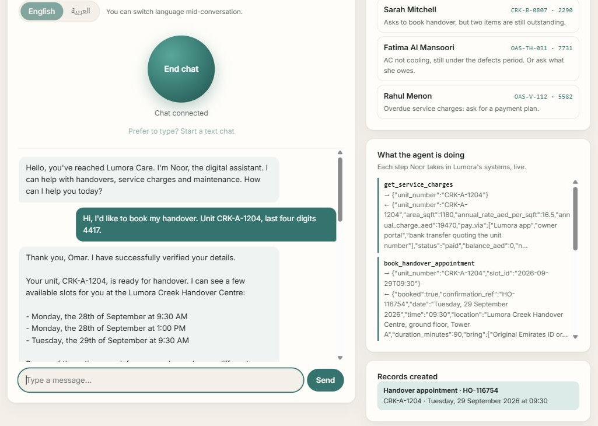
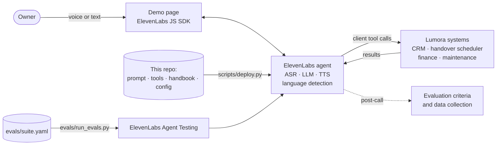

# Lumora Care: a bilingual voice agent for property-developer customer care

Noor is a voice agent built on [ElevenLabs Agents](https://elevenlabs.io/agents). She answers the owner care line for Lumora Developments, a fictional UAE property developer, in English and Arabic, and switches language mid-call when the caller does. She verifies the owner, then books handovers, explains service charges, triages maintenance, handles emergencies, and hands everything else to a person with a summary.

**[Talk to Noor: live demo](https://ryanfuruness.github.io/lumora-care-agent/)** · [Deployment brief](brief/deployment-brief.md) · [Eval results](evals/results)



## What it handles

| Capability | What Noor does |
|---|---|
| Verification | Unit number plus last four digits of the registered mobile, three attempts, enforced in the backend as well as the prompt |
| Handover | Checks readiness, explains outstanding items, offers slots, confirms, books, and says what to bring |
| Service charges | Balance, due date, overdue status, what the charges cover; payment-plan requests go to finance; never takes card details |
| Maintenance | Triages category and urgency, reads it back, logs the ticket, and says whether it's covered under the defects liability period |
| Emergencies | Safety step first (997 / 998, main water valve), then a high-priority callback and an emergency ticket |
| Human handoff | Complaints, compensation, disputes and sales go to a person as a callback with a two-sentence summary |
| Language | English or Arabic from the first word, and mid-call switching through language detection |

## Try it

Open the [demo](https://ryanfuruness.github.io/lumora-care-agent/), press **Start call** (or start a text chat), and use one of these owners:

| Owner | Unit | Last 4 | Try |
|---|---|---|---|
| Omar Haddad | CRK-A-1204 | 4417 | Book a handover, in Arabic |
| Sarah Mitchell | CRK-B-0807 | 2290 | Ask to book a handover when two items are still outstanding |
| Fatima Al Mansoori | OAS-TH-031 | 7731 | AC not cooling (under the defects period), or ask what she owes |
| Rahul Menon | OAS-V-112 | 5582 | Overdue service charges: ask for a payment plan |

The panel beside the conversation shows each step Noor takes in Lumora's systems and the records she creates. Calls are capped at four minutes, and the agent has a daily limit.

## How it works



- **The repo is the source of truth.** [`scripts/deploy.py`](scripts/deploy.py) creates or updates the tools, handbook and agent from [`agent/`](agent), so a prompt change is a commit and a redeploy.
- **Tools.** The seven tools in [`agent/tools.json`](agent/tools.json) are client tools. In the demo they run in the browser against a mock of Lumora's systems ([`docs/crm.js`](docs/crm.js)), so it needs no backend. In production the same contracts become webhook tools into the developer's CRM, scheduler, finance and maintenance systems.
- **Knowledge.** The owner handbook ([`agent/knowledge/`](agent/knowledge)) covers the handover process, the defects liability period, response times and service charges. It is about 6 KB, so it is loaded into context rather than retrieved; that saves a retrieval step on every turn.

## Design decisions

- **Verification is enforced in code.** The account tools refuse to answer until `verify_owner` has succeeded in the same conversation, so a prompt injection or a model slip cannot expose another owner's data.
- **Confirm, then act, then confirm with the reference.** Every booking, ticket and callback is read back first. Noor only says something is done once the tool has returned its reference number. The evals caught the model claiming actions it hadn't taken, and this rule came from that.
- **Emergencies skip the queue.** The safety step comes before verification, and a high-priority callback is raised before any identity questions.
- **Humans keep the judgment calls.** Noor cannot promise compensation, waivers or dates the systems don't return. She can't transfer a call live in the demo, so she never offers to.
- **Voices and models chosen for the region.** English uses an Arabic-accented British English care-agent voice on `eleven_flash_v2`. Arabic uses a Saudi customer-care voice on `eleven_flash_v2_5`. Phone and emergency numbers are read digit by digit in both languages.
- **The LLM was chosen by eval, not by default.** See below.
- **The public agent is locked down.** It only accepts sessions from the demo's domain, with a concurrency cap, a daily call limit and a four-minute maximum. The agent ID in the page is safe to publish.

## Evals

[`evals/suite.yaml`](evals/suite.yaml) defines 18 tests across eight capabilities, in English, Arabic and mixed conversations. Three kinds of test are used:

- **Simulations:** an LLM plays the caller, with Lumora's systems mocked from fixed profiles.
- **Tool-call checks:** the exact parameters of a single tool call, such as parsing "C R K, A, twelve oh four" or Arabic-Indic digits into `CRK-A-1204` and `7731`.
- **Next-reply checks:** the agent's next reply to a fixed conversation is judged against a success condition.

[`evals/run_evals.py`](evals/run_evals.py) syncs the tests to ElevenLabs Agent Testing, runs them against the deployed agent, optionally with another LLM swapped in, and writes the results to [`evals/results/`](evals/results).

**Current result: 18/18 on `gemini-3.5-flash`** ([details](evals/results/gemini-3.5-flash.md)).

Getting there took five runs, and the evals found real problems each time. The [eval history](evals/results) has the full list; the main ones were:

- In an Arabic gas emergency, the agent gave the right safety step, then kept asking for the unit number and never raised a callback.
- It offered to "connect you now" when it can't transfer live, and quoted callback times the system hadn't given.
- It claimed to have logged a ticket and arranged a callback without calling either tool.
- It agreed with a caller's summary implying compensation had been promised.

Each finding became a prompt rule, a tool-schema change or a backend guard, and the suite was rerun. The runs also chose the model. The obvious default, `gemini-2.5-flash`, is deprecated from 30 November 2026, so I compared its two likely successors on the same suite. That comparison also exposed two flaws in my own Arabic tests, which were fixed.

The agent is also configured with five post-call evaluation criteria and five data-collection fields ([`agent/agent.yaml`](agent/agent.yaml)). These score every real conversation the same way the suite does before release. They are what the [deployment brief](brief/deployment-brief.md) proposes as the pilot's quality gates and billing definition.

## Run it yourself

```bash
pip install -r requirements.txt
cp .env.example .env            # add an ElevenLabs API key with Agents write access
python scripts/deploy.py        # creates the tools, handbook and agent; writes docs/config.js
python evals/run_evals.py       # runs the suite; add --llm <model> to compare models
cd docs && python -m http.server 8000
```

To run the page locally, add `localhost:8000` to `security.allowed_hosts` in `agent/agent.yaml` and redeploy.

## Limits

- Lumora and all of its data are fictional. The mock systems reset on every conversation.
- Arabic quality is checked by the eval suite and an LLM evaluator, not yet by native-speaking reviewers. The deployment brief makes that review a gate before any real traffic.
- The demo has no telephony. In production the agent would sit on the care-line number and hand calls to the care-centre queue as a live transfer.

## Repo layout

```
agent/        prompt, tool definitions, owner handbook, voice/LLM/limits config
scripts/      deploy.py (agents as code) and a small API client
evals/        test suite, runner, results
docs/         the live demo page (GitHub Pages) and the mock Lumora systems
brief/        deployment brief: workflow redesign, rollout, value and commercial model
```
